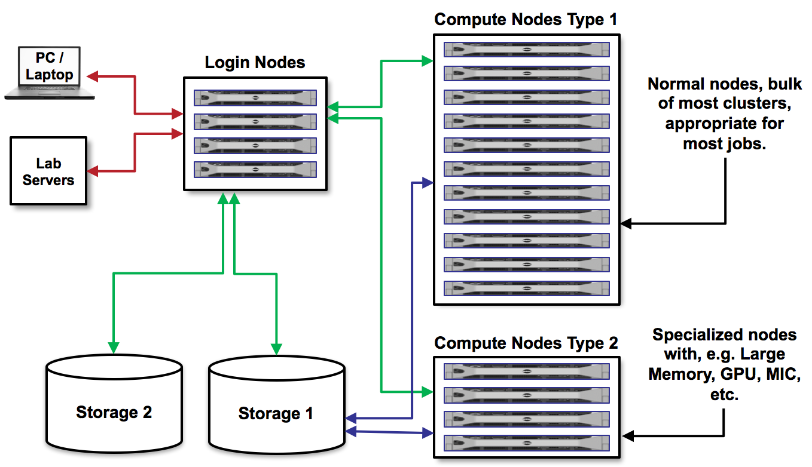

Understanding Slurm Job Submission Files
========================================

As we discussed before, on Frontera there are login nodes and compute nodes.

We cannot run the applications we need for our research on the login nodes because they require too many resources and will interrupt the work of others. 
Instead, we must write a short text file containing a list of the resources we need, and containing the command(s) for running the application. 
Then, we submit that text file to a queue to run on compute nodes. This process is called **batch job submission**.

There are several queues available on Frontera. It is important to understand the queue limitations and pick a queue that is appropriate for your job. 
Documentation can be found `here <https://docs.tacc.utexas.edu/hpc/frontera/#running-queues>`_. 
Today, we will be using the ``development`` queue which has a max runtime of 2 hours, and users can only submit one job at a time.

First, navigate to the ``Lab04`` directory where we have an example job script prepared, called ``job.slurm``:

.. code-block:: console

   $ cd
   $ cd IntroToLinuxHPC/Lab04
   $ cat job.slurm

   #!/bin/bash
   #----------------------------------------------------
   # Example SLURM job script to run applications on
   # TACCs Lonestar6 system.
   #----------------------------------------------------
   #SBATCH -J                # Job name
   #SBATCH -o                # Name of stdout output file
   #SBATCH -e                # Name of stderr error file
   #SBATCH -p                # Queue (partition) name
   #SBATCH -N                # Total # of nodes (must be 1 for serial)
   #SBATCH -n                # Total # of mpi tasks (should be 1 for serial)
   #SBATCH -t                # Run time (hh:mm:ss)
   #SBATCH -A                # Project/Allocation name (req'd if you have more than 1)

   # Everything below here should be Linux commands
